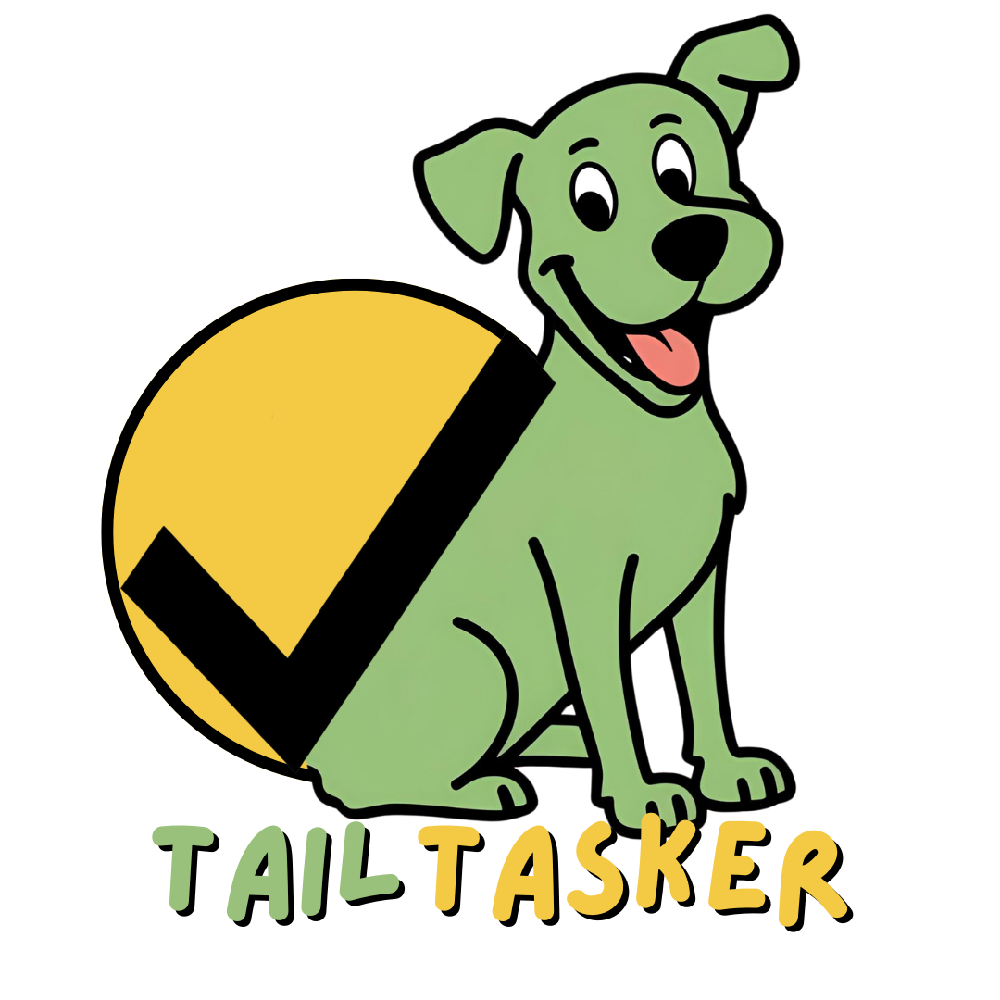

## Table of Contents

-   [Project Description](#project-description)
-   [Current Development Phase](#current-development-phase)
    -   [In Progress](#in-progress)
    -   [Planned Features](#planned-features)
-   [Contributing](#contributing)

## Project Description

Tail Tasker is a task management web application designed specifically for pet parents. The platform helps users manage and organize their pet care routines, appointments, and daily tasks. With Tail Tasker, users can create and manage pet profiles, track pet-related tasks, set reminders, and maintain a comprehensive overview of their pets' needs each day.

**Note:** Tail Tasker is currently in **active development** and the following features are being refined and expanded.

## Current Development Phase

Tail Tasker is in the **active development** phase, and several key features have already been implemented. These include:

-   **User Account Registration & Login:** Users can register for a personal account and securely login to manage their pet-related tasks and pet profiles.
-   **Add Pets:** Users can add pets to their account with basic information like name, age, breed, and type. A photo can be uploaded for each pet, or a default image will be shown if the user chooses not to upload one.
-   **Task Management:** Users can create tasks related to each pet and set deadlines for specific activities (e.g., vet appointments, feeding, walking)
-   **Comprehensive Daily Task List:** Users can view a comprehensive list of tasks for each day, with the ability to toggle between previous and upcoming days to see past and future tasks for their pets.

### In Progress

The development is currently focused on the following goals:

-   **Pet Profile Photo Management:** Finalize functionality to ensure pet profile photos upload and display properly.
-   **Recurring Task Functionality:** Implement recurring task logic, allowing users to set and manage tasks that repeat daily, weekly, monthly, or annually.
-   **Visual Indications for Task Completion:** Adding strikethrough effects and automatically reordering tasks to reflect completed items, improving user experience and task management.
-   **Pet Profile Page:** Develop a detailed pet profile page that displays additional pet information such as pet type, breed, and notes.
-   **Task Reminders:** Implement a reminder system that will send an email notification 24 hours before a task's due date, ensuring pet parents stay on top of important tasks and appointments.

### Planned Features

Future updates will include the following features to enhance the functionality of Tail Tasker:

-   **Task Filtering:** Introducing the ability to filter tasks based on specific criteria such as pet, task status, or task category, improving usability and task management.
-   **Mobile App Compatibility:** Future plans to extend Tail Tasker's functionality to mobile platforms for on-the-go task management.

## Contributing

At this stage in development, Tail Tasker is not yet open to contributions, as the key features are still under development. However, once the primary functionalities are complete, contributions will be welcomed.

Stay tuned for further announcements regarding contribution guidelines.
